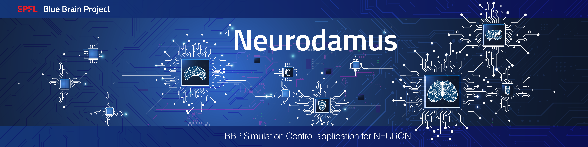

|banner|

=============
Neurodamus
=============
.. image:: https://zenodo.org/badge/DOI/10.5281/zenodo.8075202.svg
   :target: https://doi.org/10.5281/zenodo.8075202

Neurodamus is a BBP Simulation Control application for Neuron.

The Python implementation offers a comprehensive Python API for fine tuning of the simulation, initially defined by a BlueConfig file.

Description
===========

Neurodamus is the BBP in-house developed application for setting up large-scale neuronal simulations.
It has traditionally been implemented as a set of extensions to Neuron, in the form of .hoc and .mod files.
The parameters of the simulation are loaded from a configuration file, by default BlueConfig.

To address several limitations of the Hoc implementation, including development effort, the
high-level layers of Neurodamus have been reimplemented in Python.
Such implementation effectively makes available to the user a Python module with a comprehensive
API, suitable to fine control simulation aspects, as well as inspect and eventually adapt the
simulations as intended.

Install
=======

Prerequisites
-------------
- hdf5
- libsonatareport https://github.com/BlueBrain/libsonatareport
- neuron with MPI https://github.com/neuronsimulator/nrn

Install neurodamus
------------------
.. code-block:: sh

  git clone https://github.com/BlueBrain/neurodamus.git
  cd neurodamus
  pip install .

Build special with mod files
----------------------------
.. code-block:: sh

  mkdir mods
  cp -r mod-files-from-released-circuit mods/
  cp -r neurodamus-install-prefix/share/mod/* mods/
  nrnivmodl -incflags '-I <include-paths-of-our-dependencies>' -loadflags '-L <libs-paths-for-linking>' mod

Examples
========
Once installed, you should be able to find `neurodamus` in your path:

.. code-block::

  $ neurodamus
    Usage:
        neurodamus <ConfigFile> [options]
        neurodamus --help

Among the options you will find flags to tune run behavior.

Neurodamus explicitly depends on MPI libraries for parallel execution.
Therefore please use "srun" or "mpiexec" to launch it, according to your platform. If you
don't, complicated error messages may show up. Please remember it.

Even though a `neurodamus` launcher is provided, for production runs we suggest using
`special` instead. This way has proven to take advantage of optimized math libraries.
We hope to bring the same advantages to the launcher script soon.

.. code-block:: sh

 srun <srun params> <your_built_special> -mpi -python $NEURODAMUS_PYTHON/init.py <neurodamus params>

An example of a full installation with a simulation run can be found in the workflow test
`simulation_test.yaml <https://github.com/BlueBrain/neurodamus/blob/main/.github/workflows/simulation_test.yml>`__.

Docker container
================
Alternatively, you can start directly a neurodamus docker container where all the packages are built.
With the container, you can build your mod files and run simulations.
See instructions in `docker/README.md <https://github.com/BlueBrain/neurodamus/blob/main/docker/README.md>`_.

Building the docker container
-----------------------------
The docker container image is built automatically when a new tag is created in the repository, if a container with the specified version doesn't already exist.
On manual pipeline runs, the container image is also built but not automatically pushed to docker-hub; you'll have to manually start the job in the pipeline you created if you want this to happen. Keep in mind that this is *optional*, the container image is *always* pushed to the gitlab registry!

The docker images will be built in the `regular gitlab pipeline <https://bbpgitlab.epfl.ch/hpc/sim/neurodamus/-/pipelines>`_ - if triggered under the right conditions (either manually or through git tag creation) the container jobs will be added to this pipeline.

If you run the pipeline manually, you can also set versions for the dependencies:
  * `LIBSONATAREPORT_TAG`: git tag for libsonata-report
  * `LIBSONATA_TAG`: git tag for libsonata
  * `NEURON_COMMIT_ID`: commit ID for neuron
  * `REGISTRY_IMAGE_TAG`: this will be the container version. Must be specified if you specify one of the others.

Acknowledgment
==============
The development of this software was supported by funding to the Blue Brain Project,
a research center of the École polytechnique fédérale de Lausanne (EPFL),
from the Swiss government's ETH Board of the Swiss Federal Institutes of Technology.

Copyright (c) 2005-2023 Blue Brain Project/EPFL

.. substitutions

