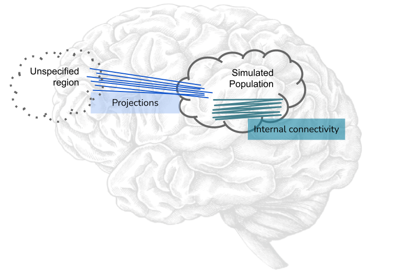
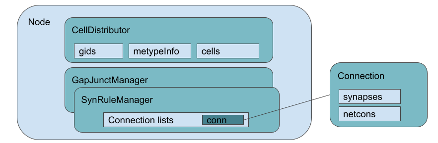
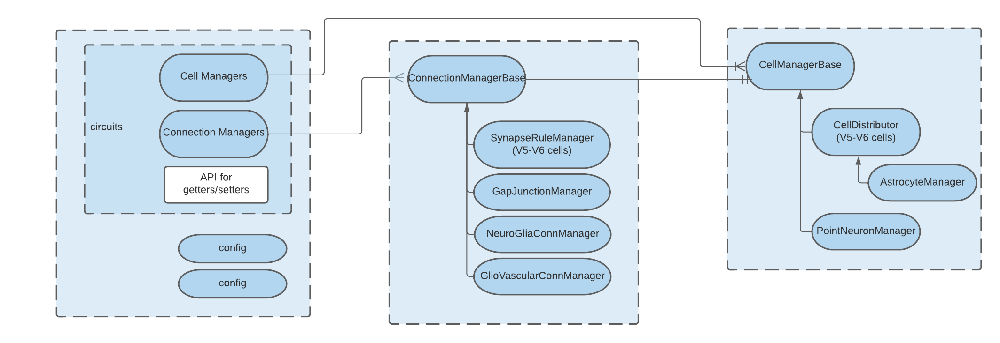
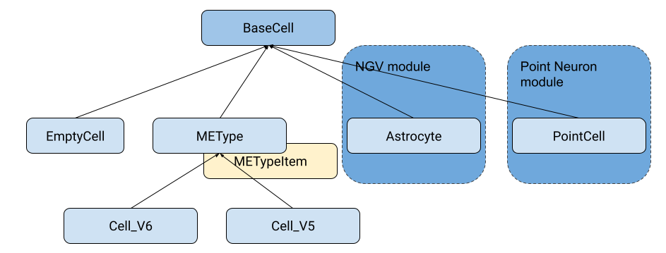
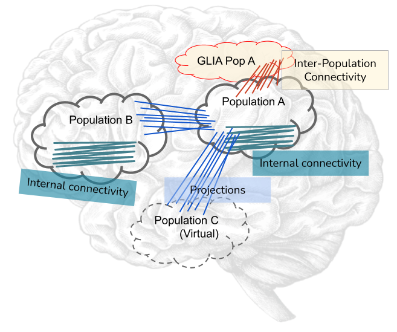
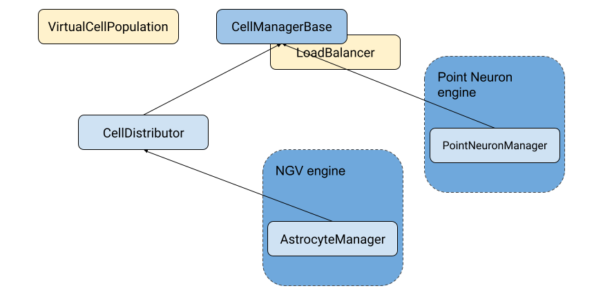
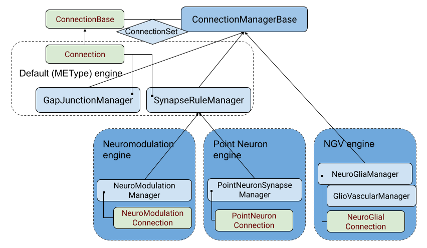
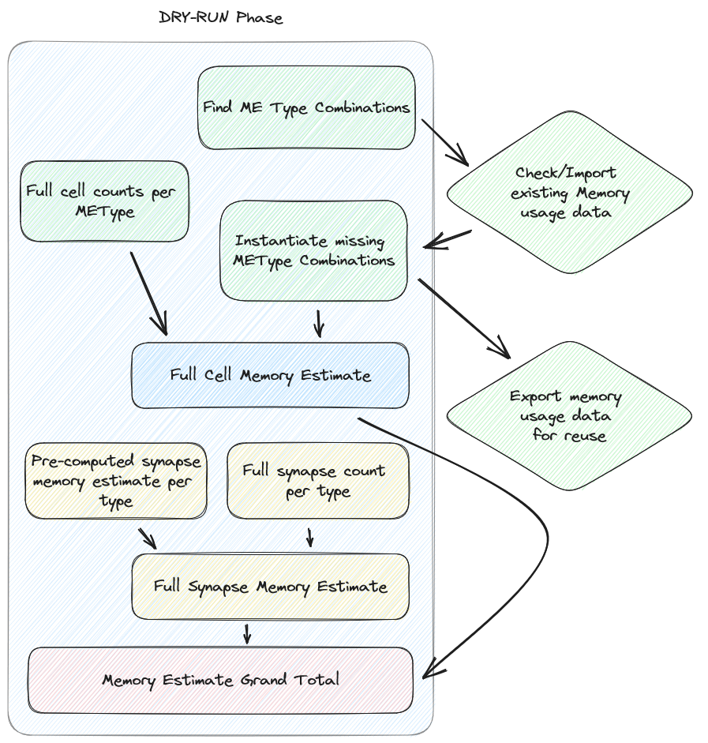

Neurodamus Developer Documentation
==================================

Historical Note
---------------

Neurodamus has evolved from a series of hoc scripts, the specific Neuron scripting language,
used to setup simulations for the BBP specific use cases.
These simulations, whose settings came from a BlueConfig file, typically featured a set of detailed
neurons and connectivity among them.

The original Hoc version handled what we nowadays call a "single population". The nodes (neurons)
and associated edges (connectivity) came from BBP proprietary formats (.ncs and .nrn respectively)
which didn't feature any identification of the region. Neuron IDs were considered absolute
and therefore, for the purpose of injecting stimulus from a simulated nearby region special
connectivity had to be produced - the projections - which had their source ids artificially offset.

Consequently the software architecture was relatively simple. The top-level objects and their
association is shown in the following diagram:

Notoriously, neurodamus has originally supported a single set of cells, handled by a single cell
distributor. Similarly, it handled all connectivity in single Synapse and Gap-Junction managers.
While several sets of connectivity could be loaded into SynapseRuleManager, they would always be
considered as targeting local cells.

**Need for Redesign**

While the sight for multi-populations could hardly be seen in the horizon, the maintainability
of these hoc scripts, with ever-more features, was getting to its limits. HOC is still a domain
specific language and using it to implement a whole simulation software, although possible, had
severe limitations, namely the lack a standard library so common language features have to be
implemented from scratch or worked-around. Furthermore it was not possible to pass CLI arguments.

In 2018 Neurodamus-py started as a pilot project to evaluate the feasibility of progressively
reimplementing higher-level parts of Neurodamus in Python, with the long-term objective of replacing
it. One of the main reasons why it was done progressively, keeping hoc in the core, was to ensure
absolutely the same results (the the bit!) than those previously created and eventually published.

Neurodamus Core Concepts
------------------------

A lot has evolved since the original Neurodamus design, but for most part the core concepts
still hold. We will initially go through the base entities:

- Node
- Cells
- Cell Manager
- Connections
- Stimulus/Stimulus Manager
- Targets
- Replay
- Reports

At a high-level design, Node is still the top-level manager of the circuits. Each circuit is
typically set by two cell managers (for source and destination cell populations) and the
connectivity among them.

This architecture can be better expressed by the following diagram:

Node
----

The `Node` class sits in the node.py file and contains all logic to run the simulation, gluing all
major components together. With the concept of multiple populations (aka multi-circuit), Node took
partially charge of this logic, aided by a new class in the same file `CircuitManager`, available
via the `circuits` property.

While lower details of `Node` functions are mostly encapsulated to dedicated classes, it still
provides API to control basically all major steps of the simulation. With this design advanced users
can build a Node object (providing a config file), control all the steps and inspect the inner
state by digging the hierarchy.

`Node` exposes the following public properties:

- circuits - A `CircuitManager` object, which handles the several node and edge managers.
- target_manager = The `TargetManager` object,  and handling all targets
- stim_manager = The manager of stimulus, interpreting and instantiating them
- elec_manager = The electrode manager
- reports = A list of Neurodamus Report hoc objects

*Notice that the Node object still owns most the top-level objects, except the cell and synapse
managers since they are now handled by the Circuits class.*

*Technical note:* These properties are read-only objects for internal attributes `_`prefixed.
Besides them, many other internal attributes exist, but at least two are worth being mentioned:
`self._base_circuit` and `self._extra_circuits`. The first

Cells
-----

A Cell is one of the central entities in Neurodamus. As referred initially, Neurodamus was born for
BBP's detailed cells use case, and that has always been internally supported.
Until BBP v5 circuits, the cell class was defined in Cell.hoc (from neurodamus-core) while
BBP v6 circuits would define its own cell hoc templates (/classes, one for each ME-type), largely
based on Cell.hoc.

Morphologically detailed neurons are the heart of a Neuron simulation. Neurodamus will read the
cells metadata from a node file in SONATA format and instantiate each
individual cell by:

- loading the morphology and instantiate the respective sections
- instantiating all the due mechanisms per section, according to the cell's morphological and
  electro-physiological type.

With some cells counting over 1000 sections, instantiating them on the simulator can be a relatively
CPU-intensive step, easily taking over 1 second per cell.

With the requirement to handle new cell types, namely astrocytes and point-neurons, Neurodamus-py
significantly redesigned the previous API so that cells follow a well-established hierarchy.

As one can see, there is a root cell type (`BaseCell`) every cell should inherit from, as it brings
the bare common properties neurodamus requires when instantiating them. These properties come
from the old interface, being: `CellRef`, `CCell` and the methods: `connect2target()` and
`re_init_rng()`.

*Note: The intermediate cell classes are abstract. So even though they implement common
functionality they are not supposed to be instantiated directly.*

Two other things are worth mentioning. First, the original V5 and V6 cells, while they shared a
great deal of logic, had their different handling in higher level routines. One encapsulated these
differences in specific classes, while maintaining the shared functionality in a common base
class for the morphologically detailed neurons - `METype`. Several cells can be instantiated from
generic me-type data (METypeItem instances).

Secondly, we see some additional cell types as being part of modules. Indeed, to make neurodamus
flexible, it supports modules/plugins, which can inclusively be dynamically loaded.
Due to extensively different logic, both these cell types inherit directly from BaseCell and they
must be handled by their own cell manager classes. To these modules implementing a new `Cell`,
`CellManagers` and eventually `ConnectionManager` types we call **Engine** - more on this later.

For the record, `Cell_V6` and the corresponding `CellDistributor` and `SynapseRuleManager`
were also made components of a special engine: the `METypeEngine`, obviously built-in (find it
in node.py).

Cell Managers
-------------

Cell managers is the resulting concept from the generalization of Neurodamus' original
CellDistributor. While CellDistributor.hoc used to handle all the loading and distribution of MeType
cells, with the refactoring into Python and the design for multiple populations and different cell
types, it became apparent that neurodamus needed a generic cell manager class which could
be requested to instantiate cells and later query them (e.g. for creating connections).
Please consider the following image.

Each instance of a cell manager will handle groups of cells (populations) which are potentially very
different among them.
Moreover notice the presence of GLIA cells, whose instantiation requires very different steps, and
even a virtual population - a hollow population which nevertheless will require its individual cell
ids (a.k.a gids).

As done for cells, cell managers follow an hierarchy as well, where the root is a generic
`CellManagerBase` class:

Any cell specific cell manager should therefore inherit from CellManagerBase.

Please notice that CellManagerBase does actually implement pretty much all the logic around managing
cells. However, a specific instance must exist for each cell type. Also, this abstract base class
doesn't contain LoadBalancing logic anymore. That whole processing has been extracted into a
`LoadBalance` class, whose objects can be used to steer cell instantiation.
Notice also a `VirtualCellPopulation` class. It basically offers the bare minimum API to be
considered a cell manager, but by far lighter than a full cell manager.

`CellManagerBase` specifies the following properties:

- Class properties,  which should be overridden in the subclasses:

  * `CellType`: The default cell class this manager handles.
  * `_node_loader`: The default loader function for nodes (cell metadata)

- Instance properties:

  * target_manager: The target manager
  * local_nodes: The metadata for the local cells, instance of `NodeSet`
  * total_cells: Total number of cells of this population (across all ranks)
  * cells: The local cell objects (instances of `cls.CellType`)
  * gid2cell: A dictionary mapping gids to the cell object
  * pc: The underlying Hoc ParallelContext object
  * population_name: The name of the Node population. Older formats (like mvd3) which don't
    provide a population name, have this property as an empty string.
  * circuit_target: The name of the original target/sonata nodeset selecting the cells.
  * circuit_name: The unique name of the circuit (set in BlueConfigs or automatic (Sonata))
  * is_default: Whether this manager handles the main/base node population (not offset)
  * is_virtual: Whether the population is virtual, i.e. cells are not instantiated, typically for
    the source of projections.
  * connection_managers: A dict of connection managers whose source population is us.

- Methods:

  * `load_nodes()`: loads the nodes (cell metadata), deferring to one of the two internal
    routines, either `_load_nodes` or `_load_nodes_balance` (the latter is used if there is load
    balance).
  * `finalize()`: instantiates the cells local to this rank. This process is composed of four
    phases, most in its own method: `_instantiate_cells`, `_update_targets_local_gids`,
    `_init_cell_network` and clear cell info.
  * `record_spikes()`: will basically do `spike_record` on each cell and return the spikevec/idvec
    `Vector` to the caller.
  * `register_connection_manager()`: Associates a given connection manager with this node manager,
    the association field being the connectivity source population.

**NOTE:** *If you are familiar with the original hoc implementation, you may notice that cell manager
`finalize` now does cell instantiation, whereas originally it happened right after loading the cell
metadata (from .mvd).
This change in design was required due to multiple-populations. One must know all cell
gids from all circuits at once so we can compute final simulation gids (with offsets) and then
proceed to cell instantiation and networking with the right ids.*

Connection Manager
------------------

Connection managers handle connectivity (aka synapses/edges) in a circuit. As mentioned earlier, it
evolved from `SynapseRuleManager` interpreting connectivity rules in a single circuit to a
generalized manager of connectivity either within a single cell population (internal connectivity),
or between two populations (src->dst).

Similar to the previous classes, significant refactoring occurred to extract common functional
blocks to an abstract base class, in this case `ConnectionManagerBase`. Such change allowed, e.g. to
get completely rid of the code redundancy between `SynapseRuleManager` and `GapJunctionManager`, to
the point the latter's initial implementation was basically a wrapper.

**ConnectionSet**

From the diagram we see the several implementations of connection managers, namely several as part
of new engines. At the very least the subclassing needs to be done to override class properties
identifying the connection type they handle, akin to cells to the cell manager.
However, in this case, a connection manager will hold not connections directly, but groups of
connections - `ConnectionSet`. This class is basically a container which a few extra functions to
add or find connections, and multiple can exist for the same Manager in case connections come from
different sources with eventually different random seeds. However, in practice, only on exceptional
cases (like support for old projections files) we will have more than one ConnectionSet.

Load Balance
------------

Due to the differences in cells and the number of connections among them, cells may incur very
different CPU loads. For that reason Round Robin cell distribution is hardly optimal and Neurodamus
provides load balancing facilities.

The way this functionality is plugged in Neurodamus is conceptually simple: one can provide a
`LoadBalance` object to the cell creation top-level routine: `node.create_cells`. This object can
be built by another top-level method: `node.compute_load_balance`. Here one basically takes into
account the load balance mode requested by the user and do a dummy circuit instantiation so that
cells' complexities can be evaluated and, with the help of Neuron, derive an optimized cell
distribution arrangement.

LoadBalance class instances (in `cell_distributor.py`) are created for the current system (CPUs) and
circuit (node files). From this point one can load or generate load balance information by targets.

Given the heavy costs of computing load balance, some state files are created
which allow the balance info to be reused.

- `cxinfo.txt`: This file tracks the "circuit" and target being simulated for which
  there is load balance done. If the user changes the circuit (node file) then
  all load balancing is invalidated and a new full loadbalance is required.
  If the simulated target changes (but not the circuit) then

  * In case the target is in the file then load balancing info is reused
  * Otherwise we check if the target is a subtarget of any other load balanced target
    -> if yes then the load balance is derived, otherwise full instantiation is required

  NOTE: For the support of multi-population load-balance, this file is being dropped, as in the
  new scheme many load-balances (one per circuit) can coexist, created in different directories.

- `cx_{TARGET}#.dat`: File with complexity information for the cells of a given target
  This file is reused in case the simulation is launched on a different CPU count,
  and it can be used to derive cx files for sub targets.

- `cx_{TARGET}#.{CPU_COUNT}.dat`: The actual load-balance file assigning cells/pieces
  to individual CPUs. It can only be reused for the same target and CPU count.

*NOTE*: Even though the `cx_{TARGET}#.{CPU_COUNT}.dat` has the cpu assignment, it goes hand-in-hand
with `cx_{TARGET}#.dat` which contains information about the cells constitution and eventual split.
Neuron actually enforces this duality and we cannot change suffixes, so bear that in mind.

Internal API
~~~~~~~~~~~~

The `LoadBalance` class provides API to verify, load and (re)generate load balances for a target.
Indeed public API represents exactly these 3 cases:

- `valid_load_distribution(self, target_spec)`: Verifies if load balance for the given target
  exists according to this instance nodes file and CPUs. It may generate the CPU assignment file
  automatically and it will also try to derive the cx files from other load-balanced targets.
  In all these happy paths it will return True, whereas a False informs the user he must take the
  long route of generating load balance data from scratch.

- `load_balance_info(self, target_spec)`: Reads the load balance information for a target from
  disk (it must exist), returning a BalanceInfo hoc object.

- `generate_load_balance(self, target_spec, cell_distributor)`: This heavy-duty context manager
  helps the user creating a new load balance. In the body of the context he should instantiate
  the nodes and synapses having an impact in the load. Is it engineered as such so that both
  preparatory actions (like creating mcomplex) and post-actions (like evaluating and saving cell
  complexity) are executed in order in a single call:

  .. code-block:: python

      with lbal.generate_load_balance(t1, cell_manager):
        cell_manager.finalize()
        conn_manager.create_connections()

Dry Run
-------

A dry run mode was introduced to help users in understanding how many nodes and tasks are
necessary to run a specific circuit. In the future this mode will also be used to improve
load balancing.

By running a dry run, using the `--dry-run` flag, the user will NOT run an actual simulation but
will get a summary of the estimated memory used for cells and synapses, including also the overhead
memory necessary to load libraries and neurodamus data structures.
A grand total is provided to the user as well as a per-cell type and per-synapse type breakdown.

At the end of the execution the user will also be provided with a suggestion on how many nodes
to use in order to run the simulation with the given circuit on the given machine.
Keep in mind that this is just a suggestion and the user is free to use a different number of nodes
if he/she wishes to do so. The suggestion is based on the assumption that the user wants to run
the simulation on the same kind of machine used to run the dry run. The suggestion is also based
on the assumption that the user wants to use all the available memory on each node for the simulation.
The node estimate takes into account the memory usage of the cells and synapses as well as the
variable usage of memory "overhead" that is fixed for each rank but varies depending on the number
of ranks used.

In this paragraph we will go a bit more into details on how the estimation is done.

Below you can see the workflow of the dry run mode:

First of all, since memory usage of cells is strongly connected to their metypes, we create a dictionary
of all the gids corresponding to a certain metype combination. This dictionary is then crosschecked
with the one imported from the external `memory_usage.json` file, which contains the memory usage
of metype combinations coming from a previous execution of dry run on this or any other circuits.
As long as the `memory_usage.json` file is present in the working directory, it will be loaded.

If the metype combination is not present in the external file, we compute the memory usage of the
metype combination by instantiating a group of (maximum) 50 cells per metype combination and then
measuring memory usage before and after the instantiation. The memory usage is then averaged over
the number of cells instantiated and the result are saved internally and added to the external
`memory_usage.json` file. Any combination already present in the external file is simply imported
and is not instantiated again in order to speed up the execution. One can simply delete the `memory_usage.json`
file (or any relevant lines) in order to force the re-evaluation of all (or some) metype
combinations.

The memory usage of synapses is instead estimated using a pre-computed look up table, which is
hardcoded in the `SynapseMemoryUsage` class. The values used for this look up table were computed by using an external script
to instantiate 1M synapses of each type, each with 1K connections, and then measuring the memory
usage before and after the instantiation. The memory usage is then averaged over the number of
synapses instantiated. The script used to perform this operation `synstat.py` is available for the user
and is archived in this repo in the `_benchmarks` folder.

Having these pre-computed values, we just need to estimate the amount of synapses of each type
and multiply it by the corresponding memory usage value. Even in this case we have adopted a
sample-based approach. First of all, we filter out any gids that have already been
counted (which can happen when the same gid is part of the target in several `synapse_override` blocks).
Then we sample synapse counts of the circuit in progressively bigger blocks. This technique avoids
exhausting memory and scales well, enabling sampling over very large circuits in a short time,
typically a few minutes for millions of cells.

The paramenters of the sampling are as follows:

- Block start length: 5000, increasing at a rate of 10% at each iteration
- Count synapses for each block: 100 cells of the block (taking advantage of data locality)
- Finally, extrapolate for the whole block and add to global metype estimate.

Having estimated the number of synapses for each metype, we can finally compute the memory usage
of synapses by multiplying the number of synapses by the corresponding memory usage value.

Apart from both cells and synapses, we also need to take into account the memory usage of neurodamus
itself, e.g. data structures, loaded libraries and so on. This is done by measuring the RSS of the neurodamus
process before any of the actual instantiation is done. This value, since it's averaged over all ranks that take
part in the execution, is then multiplied by the number of ranks used in the execution.

The final result is then printed to the user in a human readable format together with an estimate
of the number of nodes needed to run the simulation on the same machine used to run the dry run.

Dry Run Memory Load Balancing
~~~~~~~~~~~~~~~~~~~~~~~~~~~~~~

The dry run mode also provides a memory load balancing feature. It helps balance the memory usage
of the ranks of the simulation, so that the user does not incur easily in out-of-memory errors.

The workflow of the memory load balancing is as follows: for each cell in the circuit we have an
estimate of both the memory load of the cell itself based on their METype and the amount of synapses
that each METype has on average. With this information we can have a good estimate of the memory
load of each gid in the circuit.

We've opted for a greedy approach to distribute the gids in order to keep the implementation simple
and fast. The algorithm is as follows:

- Sort our ranks in a heap so that the emptiest rank is always at the top
- Assign gids in batches of 10 to the emptiest rank
- Rince and repeat until all gids are assigned

The user can specify the number of ranks to target using the `--num-target-ranks` flag in the CLI of neurodamus.
The default value is 40. The allocation dictionary, containing the assignment of gids to ranks per each population,
is then saved to the `allocation.pkl.gz` file in a pickled gzipped format.

Now that the `allocation.pkl.gz` has been generated, the user can load it in the main simulation and use it to load balance the
simulation. The user can do this by using the `--lb-mode=Memory` flag in the CLI of neurodamus. During the execution
Neurodamus will check if the amount of ranks used in the simulation is the same as the amount of ranks used in the
dry run. If the amount of ranks is different, the user will be prompted to run a new dry run with the new amount of
ranks. If the amount of ranks is the same, the allocation dictionary will be loaded and used to load balance the
simulation.

This way the exact gids that were assigned to each rank in the dry run will be assigned to the actual simulation,
possibly avoiding out-of-memory errors.

Development
------------

You can find more information `here <development.rst>`_.
