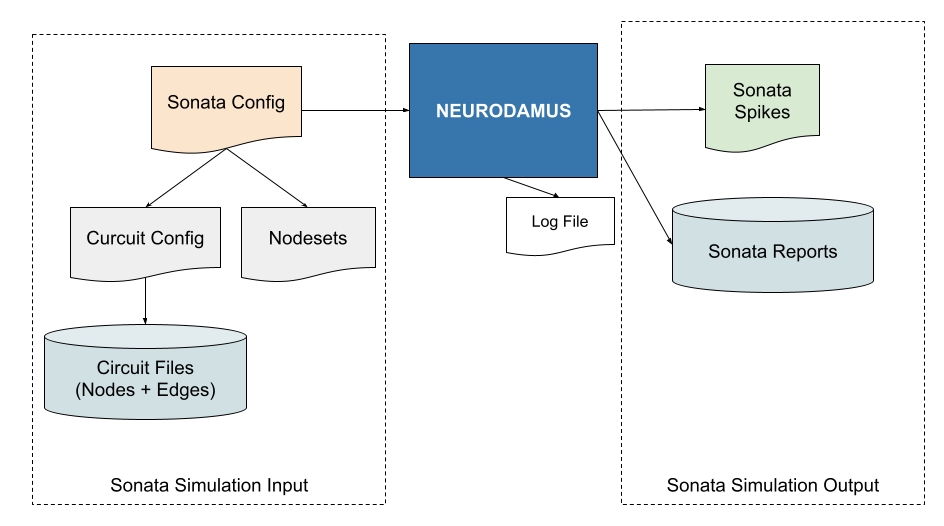

Setting up a Sonata simulation
==============================

Neurodamus now supports the SONATA open-source format for its input and output files.

The full specification, including BBP extensions, is available at the BBP Circuit Documentation
pages
https://sonata-extension.readthedocs.io/en/latest/sonata_overview.html.

The Sonata specification prescribes the file format for all Simulation inputs and outputs, as
depicted in the following image:

The Sonata simulation input files
---------------------------------

Neurodamus CLI expects a simulation configuration file which can provide all the settings, namely
the definition of the circuit and the parameters of the simulation.

This file is the successor of the BlueConfig, but with some important changes.

Contrary to BlueConfig the Sonata simulation config only deals with the simulation parameters,
leaving out the details of the circuit, in particular the location of the composing files.

For the complete reference please refer to `sonata_simulation documentation
<https://sonata-extension.readthedocs.io/en/latest/sonata_simulation.html>`_

As an example let's consider an Hippocampus sample simulation (
`Hippocampus-mini-simultion-config <https://bbpgitlab.epfl.ch/hpc/sim/blueconfigs/-/blob/main/sonataconf-quick-hip-multipopulation/simulation_config.json>`__)

Fundamental simulation parameters
~~~~~~~~~~~~~~~~~~~~~~~~~~~~~~~~~

+-------------------------------------------+-----------------------------------------------+
| Sonata Config                             | BlueConfig                                    |
+-------------------------------------------+-----------------------------------------------+
|                                           |                                               |
| .. code-block:: json                      | .. code-block:: console                       |
|                                           |                                               |
|   "run": {                                |   Run Default                                 |
|   "tstop": 100.0,                         |   {                                           |
|     "dt": 0.025,                          |     Duration 100                              |
|     "random_seed": 264118,                |     Dt 0.025                                  |
|   },                                      |     BaseSeed 264118                           |
|                                           |                                               |
|   "target_simulator": "NEURON",           |     Simulator NEURON                          |
|   "network": "circuit_config.json",       |     # BlueConfig had circuit defs inline      |
|   "node_sets_file": "node_sets.json",     |     TargetFile mooc-circuit/user.target       |
|   "node_set": "most_central_100_SP_PC",   |     CircuitTarget hippocampus_neurons:central |
|                                           |                                               |
|   "output": {                             |     OutputRoot output                         |
|     "output_dir": "output_sonata",        |                                               |
|     "spikes_file": "out.h5",              |     RNGMode Random123  # deprecated           |
|     "spikes_sort_order": "by_time"        |     RunMode RR         # deprecated. use CLI  |
|   },                                      |   }                                           |
|                                           |                                               |
+-------------------------------------------+-----------------------------------------------+

The top of the file specifies the fundamental simulation parameters. In particular the `run` block
must exist and set tstop and dt. Moreover, the `target_simulator` block is a top-level entity now,
which defaults to NEURON.

The second block selects which circuit is to be simulated. This is the main difference wrt BlueConfig.
`network` should point to the circuit config file which, as showing in the diagram, contains
information about the location of the files building it up. Therefore this entry replaces all
entries specifying circuit files, namely `CircuitPath`, `MorphologyPath`, `MorphologyType`,
`METypePath`, `MEComboInfoFile`, `CellLibraryFile`, `nrnPath`.

There will likely be such files available per circuit, but the user may define himself a custom one.
Please refer to the `Additional Examples`_ section.

`node_sets_file` should point to a file defining Sonata nodesets. More on ths in the next section.

The `nodeset` is basically the selection of nodes (defined in the node_sets_file) which will be
simulated. If not set Neurodamus will choose all non-virtual nodes of all populations.

The Sonata Nodeset file
~~~~~~~~~~~~~~~~~~~~~~~

Nodesets are selectors, in the form of filter expressions or cell IDs, that can be referenced in
several points of the configuration, namely to select the simulation or reporting targets.

Please find the full documentation at
https://sonata-extension.readthedocs.io/en/latest/sonata_nodeset.html

In the current example `most_central_100_SP_PC` must be defined in `node_sets.json`, in this case:

.. code-block:: json

    "most_central_100_SP_PC": {
      "population": "hippocampus_neurons",
      "node_id": [
        11616,
        6392,
        6788,
      ]
    }

Notice that, by default the filtering rules or node IDs try to match against all available
populations, and therefore specifying which population the rules should apply is generally required.

Additional Examples
-------------------

You can find a number of examples of curated Sonata simulations in the
`blueconfigs repository <https://bbpgitlab.epfl.ch/hpc/sim/blueconfigs>`__

Here's a quick list of them which can be used as inspiration:

.. list-table:: Example Sonata
   :widths: 26 26 26 22
   :header-rows: 1

   * - Circuit kind
     - Simulation Config
     - Circuit config
     - Node Sets
   * - Hippocampus
     - `simulation_config.json <https://bbpgitlab.epfl.ch/hpc/sim/blueconfigs/-/blob/main/sonataconf-quick-hip-multipopulation/simulation_config.json>`__
     - `circuit_config.json <https://bbpgitlab.epfl.ch/hpc/sim/blueconfigs/-/blob/main/sonataconf-quick-hip-multipopulation/circuit_config.json>`__
     - `node_sets.json <https://bbpgitlab.epfl.ch/hpc/sim/blueconfigs/-/blob/main/sonataconf-quick-hip-multipopulation/node_sets.json>`__
   * - SSCX
     - `simulation_config.json <https://bbpgitlab.epfl.ch/hpc/sim/blueconfigs/-/tree/main/sonataconf-quick-scx-multi-circuit/simulation_config.json>`__
     - `circuit_config.json <https://bbpgitlab.epfl.ch/hpc/sim/blueconfigs/-/tree/main/sonataconf-quick-scx-multi-circuit/circuit_config.json>`__
     - `node_sets.json <https://bbpgitlab.epfl.ch/hpc/sim/blueconfigs/-/tree/main/sonataconf-quick-scx-multi-circuit/node_sets.json>`__
   * - Thalamus
     - `simulation_config.json <https://bbpgitlab.epfl.ch/hpc/sim/blueconfigs/-/blob/main/sonataconf-quick-thalamus/simulation_config.json>`__
     - `circuit_sonata.json <file:///gpfs/bbp.cscs.ch/project/proj12/SIT/thalamus_sonata/circuit_sonata.json>`__
     - `node_sets.json <https://bbpgitlab.epfl.ch/hpc/sim/blueconfigs/-/blob/main/sonataconf-quick-thalamus/node_sets.json>`__

Supported features
------------------

Here is a summary of main features supported by the Sonata simulation config file. Details on the parameters can be found in `sonata_simulation documentation <https://sonata-extension.readthedocs.io/en/latest/sonata_simulation.html>`_.

.. list-table::
   :header-rows: 1

   * - Component
     - Support
     - Comments
   * - Nodes and Edges
     - Full
     -
   * - NodeSets (multiple populations)
     - Full
     -
   * - Multi-population reports
     - Full
     -
   * - Simulation configuration
     - Full
     -
   * - Sonata specific stimuli
     - Partial
     - Pending features: PulseTI stimuli, Extracellular stimuli.
   * - NGV support
     - Partial
     - Results being validated.
   * - Point Neuron simulation
     - Partial
     - No report. No replay.
   * - Neuromodulation
     - Partial
     - No replay.
   * - Deprecation of BlueConfig sections
     - Partial
     - Modifications, Electrode, Projection [#f1]_.
   * - Non-Sonata Configuration as CLI
     - Full
     - New args: --save=<PATH>, --save-time=<TIME>, --restore=<PATH>, --lb-mode=[RoundRobin, WholeCell, MultiSplit], --dump-cell-state=<GID>.

.. [#f1] The Projection section is merged into the circuit config file.

.. include:: sonata-faq.rst
